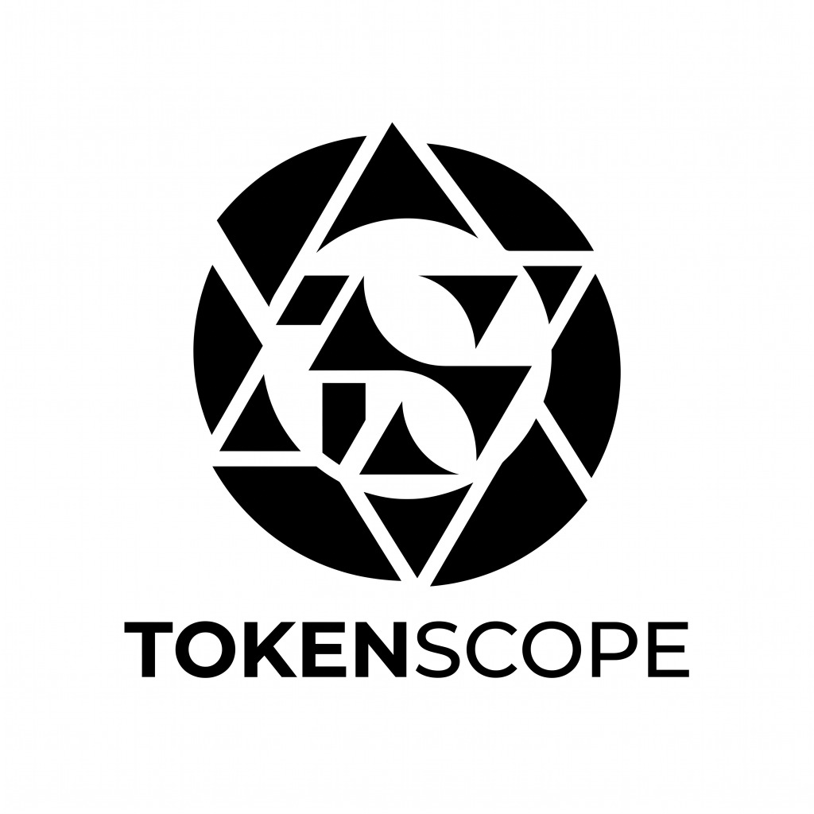
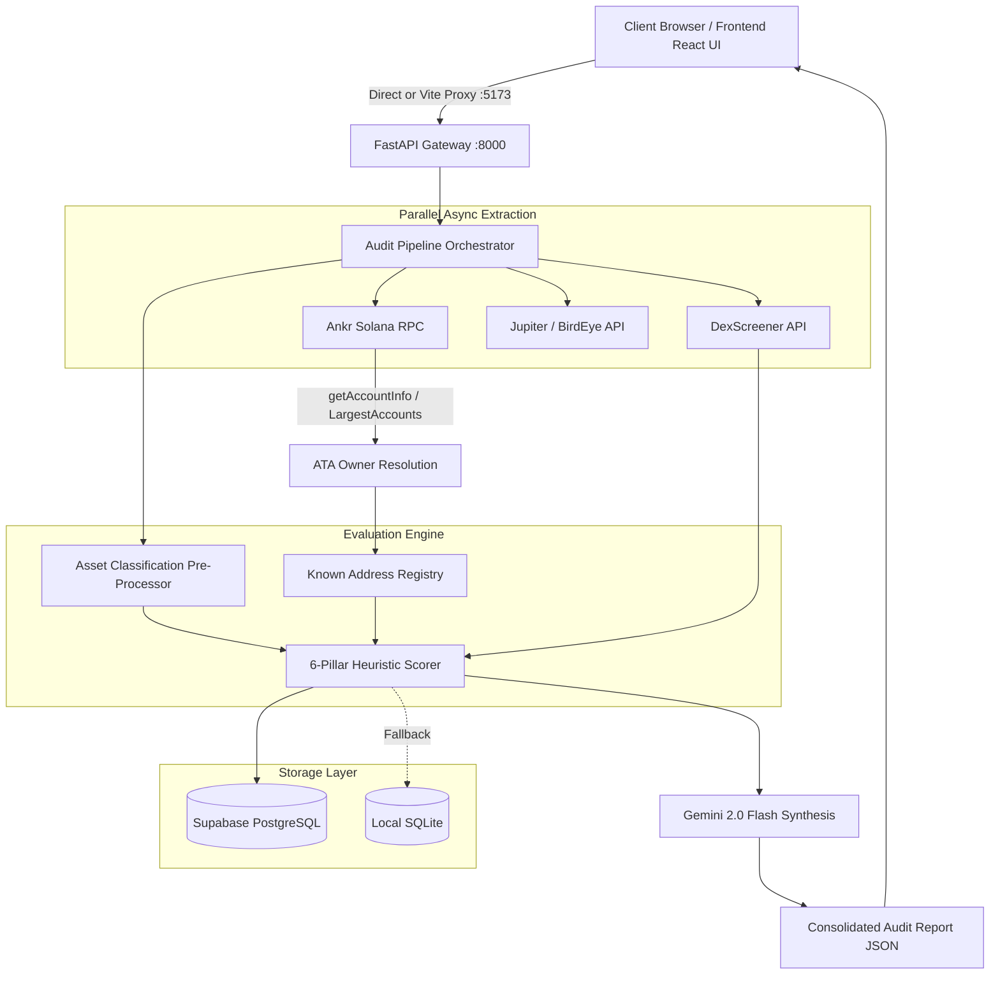

<p align="center">
  
</p>

<h1 align="center">TokenScope</h1>

<p align="center">
  <strong>Institutional-Grade Due Diligence & Risk Intelligence Engine for Solana Tokens</strong>
</p>

<p align="center">
  <a href="https://fastapi.tiangolo.com/"></a>
  <a href="https://react.dev/"></a>
  <a href="https://solana.com/"></a>
  <a href="https://ai.google.dev/"></a>
  <a href="https://vitejs.dev/"></a>
  <a href="https://tailwindcss.com/"></a>
  <a href="LICENSE"></a>
</p>

---

## 📌 Executive Overview

**TokenScope** is a high-speed, institutional-grade risk intelligence platform designed for the Solana blockchain. By inputting any Solana token mint address, investors, developers, and institutions receive an exhaustive audit report synthesized across **6 foundational risk pillars** in seconds.

Unlike generic memecoin scanners that produce high rates of false positives, TokenScope incorporates an **Asset Classification Pre-Processor**, **Associated Token Account (ATA) Owner Resolution**, and **AI-Driven Risk Synthesis powered by Google Gemini 2.0 Flash**.

---

## 🚀 Key Innovations

### 1. 🛡️ Asset Classification Engine (False-Positive Elimination)
Standard token scanners flag regulated stablecoins (USDC, USDT, PYUSD) or canonical wrapped assets (WSOL) as malicious "High Risk" honeypots due to active mint and freeze authorities.
- **Context-Aware Rules**: Identifies canonical assets and waives penalties for operational necessities (e.g. reserve elasticity, sanctions compliance).
- **Correct Pair Resolution**: Resolves target token address against DEX liquidity pool pairs (base vs quote) to guarantee precise pricing and peg tracking rather than defaulting to base assets.
- **Sanitized Presentation**: Automatically normalizes token symbols to eliminate double-prefix bugs (e.g. `$$WIF` &rarr; `$WIF`).

### 2. 🏦 Smart CEX / DEX Known Address Tagging & ATA Parsing
`getTokenLargestAccounts` on Solana returns Token Accounts (ATAs), not the underlying wallet owner. Naive scanners flag cold storage reserves or AMM vaults as insider whales.
- **Two-Step ATA Resolution**: Resolves ATAs to root owner public keys using `getMultipleAccounts`.
- **Known Entity Registry**: Cross-references owners against major centralized exchanges (**Binance**, **Coinbase**, **Bybit**, **OKX**, **Gate.io**) and decentralized liquidity vaults (**Raydium AMM/CLMM**, **Orca Whirlpools**, **Meteora**, **Pump.fun**).
- **Concentration Neutralization**: Known exchange and pool reserves are tagged and excluded from insider concentration calculations.

### 3. 🧠 LLM Risk Synthesis (Google Gemini 2.0 Flash)
- Produces a plain-English, executive-level risk summary tailored to retail and institutional readers.
- Automatically contextualizes regulatory compliance and reserve management for stablecoins while applying rigorous scrutiny to unverified SPL tokens.

### 4. ⚡ Dual Persistence & Reverse Proxy Architecture
- **Zero-Config Database**: Reads and writes to **Supabase PostgreSQL** with automated fallback to local **SQLite** (`tokenscope.db`) for resilient offline and local development.
- **Integrated Reverse Proxy**: Pre-configured Vite reverse proxy (`/api`) routing seamlessly to the FastAPI backend, eliminating CORS errors and cross-origin configuration friction.

---

## 🏗️ Architecture & Data Flow



---

## 📊 The 6 Risk Pillars & Weighting

| Pillar | Weight | Key Metrics Evaluated | Heuristic Logic & Auto-Rules |
|---|---|---|---|
| **1. Security** | **35%** | Mint Authority, Freeze Authority, LP Burn/Lock | • Mint enabled on standard SPL caps score at $\le 30/100$ (CRITICAL)<br>• Stablecoins credit reserve elasticity without penalty |
| **2. Holder Distribution** | **25%** | Top 10 Concentration, Largest Whale Dominance | • Resolves ATAs to owner addresses<br>• Excludes tagged CEX cold wallets and DEX pools from insider concentration |
| **3. Market Health** | **15%** | Liquidity USD, 24h Volume, Market Cap, Volatility | • Liquidity depth vs market cap ratio<br>• 24h trade count and unique trader velocity |
| **4. Contract Intelligence** | **10%** | Program Standard (SPL vs Token-2022), Mutability | • Checks Metaplex metadata mutability<br>• Identifies non-standard extension hooks |
| **5. Social Validity** | **15%** | Website, Twitter/X, Telegram, Discord, Issuer Verification | • Credits verified institutional issuers<br>• Deducts points for missing social presence on unverified SPL tokens |
| **6. AI Risk Summary** | **Synthesis** | Google Gemini 2.0 Flash plain-English synthesis | • High-risk factor distillation<br>• Peg stability & solvency focus for stablecoins |

---

## 🎨 Design Philosophy — Institutional Terminal

TokenScope features a refined institutional aesthetic inspired by Bloomberg terminals, Linear, and Stripe:
- **Dominant Tone**: Pure white background (`#FFFFFF`) with generous whitespace.
- **Accents & Text**: Near-black (`#0A0A0A`) with subtle gray borders (`#E5E7EB`).
- **Typography**: 
  - Primary UI & Copy: **Inter**
  - Metrics, Addresses & Raw Data: **IBM Plex Mono**
- **Risk Badges**: 
  - `SAFE`: Emerald Green (`#059669`)
  - `CAUTION`: Amber Yellow (`#D97706`)
  - `HIGH RISK`: Rose Red (`#DC2626`)
  - `LIKELY RUG`: Crimson Dark (`#991B1B`)

---

## 🛠️ Technology Stack

- **Frontend**: React 18, Vite 5, Tailwind CSS 3, Lucide Icons, Chart.js
- **Backend**: Python 3.10+, FastAPI, Uvicorn, Pydantic, HTTPX
- **AI Engine**: Google Gemini API (`gemini-2.0-flash`)
- **Blockchain RPC**: Ankr Public Solana RPC (`https://rpc.ankr.com/solana`)
- **Market Aggregators**: DexScreener, Jupiter v2, BirdEye
- **Persistence**: Supabase (PostgreSQL) + SQLite (zero-config local fallback)

---

## ⚡ Quickstart Guide

### Prerequisites
- **Python**: `3.10` or higher
- **Node.js**: `18.0` or higher (`npm` included)
- **Git**: Installed and configured

### 1. Clone the Repository
```bash
git clone https://github.com/adeyanjufuhad/TokenScope.git
cd TokenScope
```

### 2. Backend Setup
```bash
# Navigate to backend
cd backend

# Create and activate virtual environment (optional but recommended)
python -m venv venv
# Windows:
.\venv\Scripts\activate
# macOS/Linux:
source venv/bin/activate

# Install dependencies
pip install -r requirements.txt

# Configure environment variables
copy .env.example .env

# Run FastAPI server
python -m uvicorn main:app --host 0.0.0.0 --port 8000
```
Backend API will be running at `http://localhost:8000`. Interactive OpenAPI documentation is accessible at `http://localhost:8000/docs`.

### 3. Frontend Setup
```bash
# In a new terminal window, navigate to frontend
cd frontend

# Install dependencies
npm install

# Start Vite development server
npm run dev
```
Open `http://localhost:5173` in your browser. All API requests to `/api` are automatically proxied to the backend at `http://127.0.0.1:8000`.

---

## 🔐 Environment Variables

### Backend Configuration (`backend/.env`)

| Variable | Required | Default / Example | Description |
|---|---|---|---|
| `SOLANA_RPC_URL` | No | `https://rpc.ankr.com/solana` | Solana JSON-RPC endpoint. |
| `GEMINI_API_KEY` | Optional | `AIzaSy...` | Google Gemini API key for AI risk synthesis. |
| `BIRDEYE_API_KEY` | Optional | `...` | BirdEye token analytics key. |
| `SUPABASE_URL` | Optional | `https://xyz.supabase.co` | Supabase project URL. |
| `SUPABASE_ANON_KEY` | Optional | `...` | Supabase anonymous public key. |
| `PORT` | No | `8000` | Backend listening port. |

> **Note**: If `SUPABASE_URL` or `GEMINI_API_KEY` are not provided, TokenScope automatically falls back to local SQLite persistence and rule-based heuristic summaries, allowing seamless out-of-the-box local testing.

---

## 📡 API Reference

### 1. Initiate Token Audit
```http
POST /api/v1/audit
Content-Type: application/json

{
  "mint_address": "EPjFWdd5AufqSSqeM2qN1xzybapC8G4wEGGkZwyTDt1v"
}
```

#### Response:
```json
{
  "report_id": "e99cb634-5761-429b-9d3a-bfc5b5571c1d",
  "mint_address": "EPjFWdd5AufqSSqeM2qN1xzybapC8G4wEGGkZwyTDt1v",
  "status": "processing",
  "message": "Audit initiated in background",
  "cached": false
}
```

---

### 2. Fetch Audit Report
```http
GET /api/v1/report/{report_id}
```

#### Response (200 OK):
```json
{
  "report_id": "e99cb634-5761-429b-9d3a-bfc5b5571c1d",
  "mint_address": "EPjFWdd5AufqSSqeM2qN1xzybapC8G4wEGGkZwyTDt1v",
  "token_name": "USD Coin",
  "token_symbol": "USDC",
  "asset_classification": "STABLECOIN",
  "issuer": "Circle Financial Inc.",
  "overall_score": 100,
  "verdict": "SAFE",
  "pillars": {
    "security": { "score": 100, "mint_authority_revoked": false },
    "holders": { "score": 100, "insider_top_10_percentage": 23.68, "cex_dex_percentage": 9.83 },
    "market": { "score": 100, "liquidity_usd": 1120611824, "price_usd": 0.9998 },
    "contract": { "score": 95, "token_program": "SPL Token" },
    "social": { "score": 100, "issuer": "Circle Financial Inc." }
  },
  "ai_summary": "This canonical stablecoin issued by Circle Financial Inc. features deep onchain liquidity, massive daily volume, and a reliable dollar peg..."
}
```

---

### 3. Health Check
```http
GET /api/v1/health
```

#### Response (200 OK):
```json
{
  "status": "healthy",
  "service": "TokenScope Backend",
  "timestamp": "2026-09-10T00:10:00+00:00"
}
```

---

## 🧪 Testing & Verification

Run the automated test suite covering onchain ATA resolution, stablecoin heuristics, and SQLite/Supabase persistence:

```bash
# Run pytest in the project root
pytest backend/tests
```

Build the frontend bundle for production:
```bash
cd frontend
npm run build
```

---

## 🚢 Deployment

### Frontend (Vercel)
1. Push repository to GitHub.
2. Import project into Vercel.
3. Set **Root Directory** to `frontend`.
4. The included `frontend/vercel.json` will automatically handle SPA client routing.

### Backend (Railway / Render / Docker)
1. Import repository into Railway.
2. Set **Root Directory** to `backend`.
3. Configuration is handled automatically via `backend/railway.json` and `backend/Procfile`.
4. Supply `SOLANA_RPC_URL` and `GEMINI_API_KEY` in environment variables.

---

## 📄 License & Disclaimer

This project is licensed under the [MIT License](LICENSE).

**Disclaimer**: TokenScope is an analytics and risk intelligence tool designed for informational and educational purposes only. Scores, classifications, and AI risk summaries do not constitute financial, investment, or legal advice. Always conduct independent due diligence before interacting with cryptocurrency assets.
